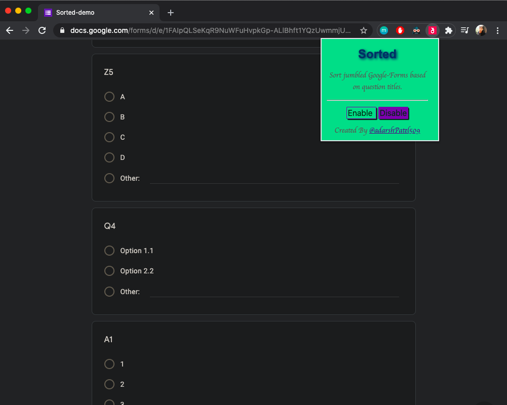
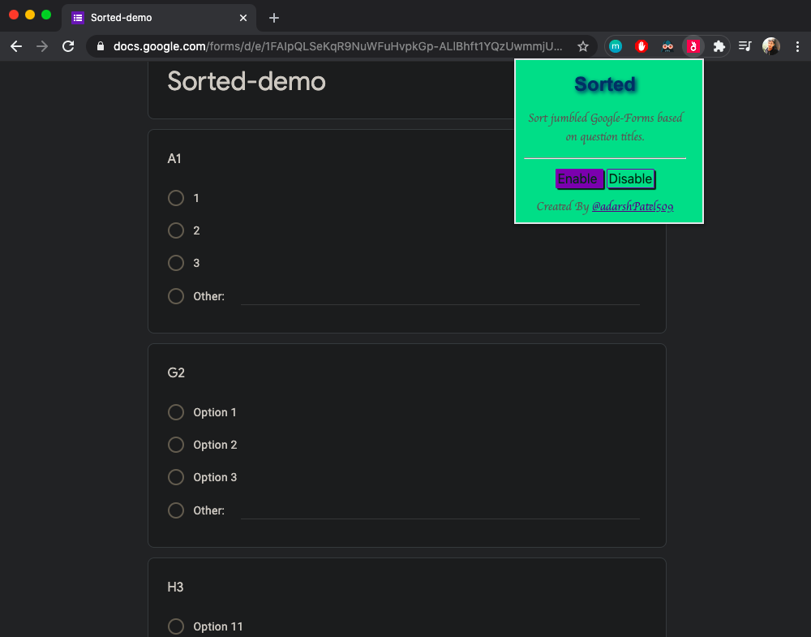

# Sorted

### Sort jumbled Google-Forms based on question titles.

## Want to Install?

Sorry, can't pay google $5 to get developers account and publish it :(

```
1. clone the project
2. open a new Chrome Tab and visit to chrome://extensions
3. Enable developer mode option on top-right
4. Click on Load-unpacked option on top-left and select cloned project directory
5. Yeyy! Extension is installed now, you can see it under extensions list  
```

## Screenshots

**When disabled**


**When enabled**

## Reporting Issues

If you think you've found a bug or something isn't behaving the way you think it should, please raise an [issue](https://github.com/adarshPatel509/sorted/issues) on GitHub. New feature suggestions are welcome.

### *Happy Coding!* 🍻🍻